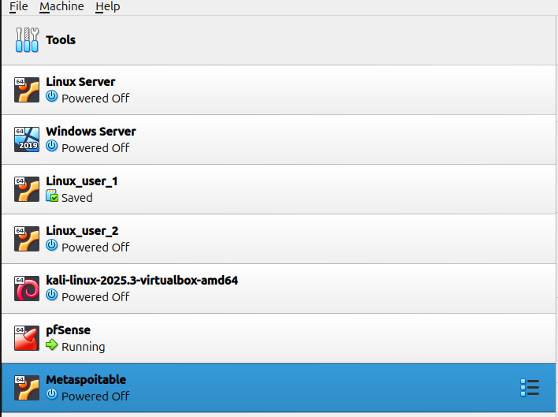
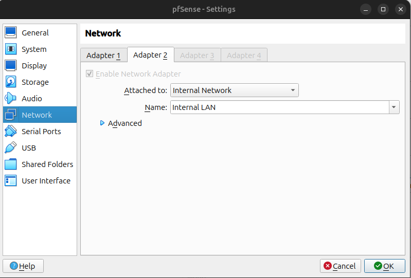

# Cyber Lab — VirtualBox Environment

### Overview
This repository documents a complete **cybersecurity virtual lab** built in **VirtualBox** for ethical hacking, penetration testing, and network defense training.

It includes **7 virtual machines** connected through a simulated LAN network managed by **pfSense**.

---

## Lab Architecture

| Role | Operating System | Purpose | Status |
|------|------------------|----------|---------|
|  **pfSense** | FreeBSD (Firewall) | Acts as the firewall & router (Internal LAN) | ✅ Configured |
|  **Kali Linux** | Debian-based | Penetration testing and network attacks | ✅ Installed |
|  **Windows Server 2019** | Microsoft | Domain Controller, shared services | ✅ Installed |
|  **Linux Server** | Ubuntu Server | Web & SSH services | ✅ Installed |
|  **Linux User 1** | Ubuntu Desktop | Internal user workstation | ✅ Networked |
|  **Linux User 2** | Ubuntu Desktop | Internal user workstation | ✅ Networked |
|  **Metasploitable 2** | Linux | Vulnerable target machine for exploitation | ✅ Installed |

---

##  Network Topology

Kali (Attacker) ─ pfSense (Firewall/NAT) ─ Internal LAN ─ Linux/Windows/Metasploitable

- **Adapter 1 (NAT):** Internet access for updates  
- **Adapter 2 (Internal LAN):** Isolated lab network for attacks  

---

## ⚙️ Features

- pfSense firewall and NAT routing  
- Internal LAN network isolation  
- Multi-OS setup (Windows + Linux)  
- Metasploitable for vulnerability testing  
- Safe local environment for ethical hacking practice  

---

## Screenshots

**VM list (VirtualBox)**  

**pfSense — Adapter 2 (Internal LAN)**  

**pfSense — Adapter 1 (Bridged / Host network)**  

---

## 🧾 Notes
All machines are configured manually in VirtualBox.  
Each VM is stored locally and **not** shared publicly for security reasons.  
This documentation is for educational and research use only.

---

## 📜 License
Licensed under the [MIT License](LICENSE).
